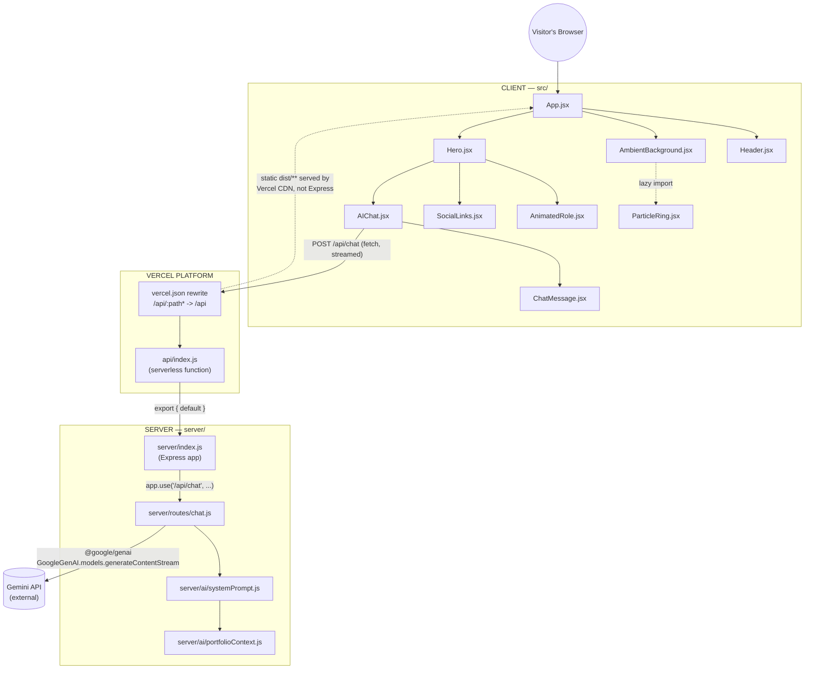
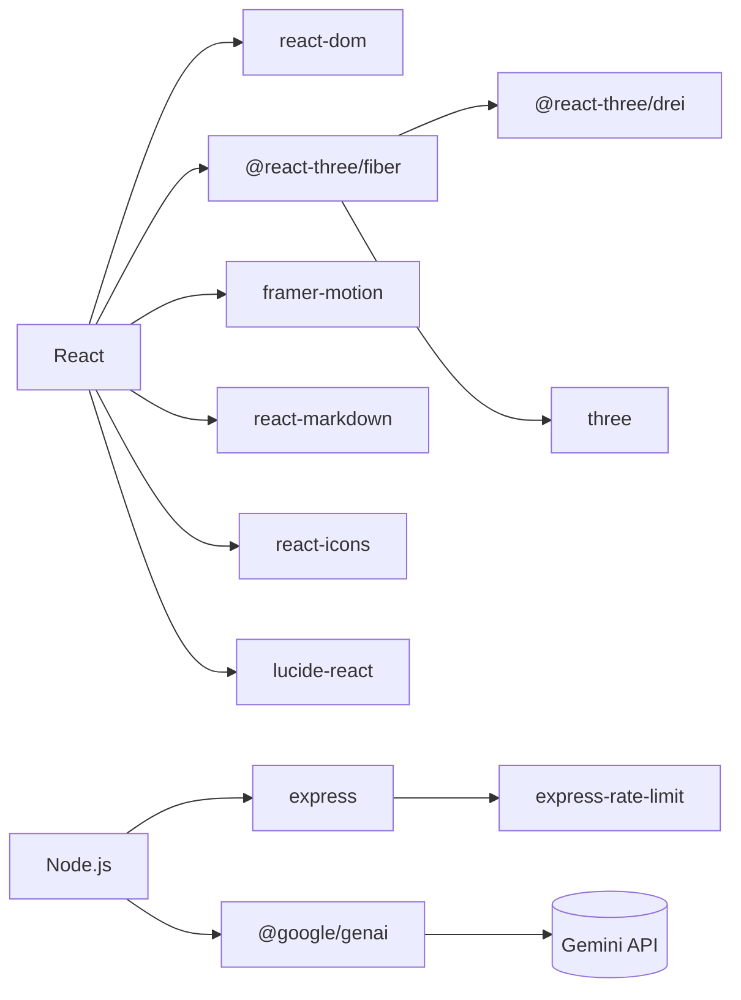

# Architecture Map

The real system, traced from source. Every node below corresponds to an actual file or actual external service — see [[Source-Code-Map]] for the file mapping.

## High-level

## Client / Server / External boundary

See [[Security]] for the full trust-boundary writeup. Summary:

- **CLIENT** (runs in the visitor's browser): React, Tailwind CSS, Framer Motion, Three.js / React Three Fiber. No secrets, no direct external API calls — the only network call it makes is same-origin `fetch("/api/chat")`.
- **SERVER** (runs only inside the Vercel function / local Node process): Express, `express-rate-limit`, `@google/genai`. Holds `GEMINI_API_KEY`.
- **EXTERNAL**: Gemini API (called from the server only). GitHub and Vercel are development/deployment infrastructure, not runtime dependencies of the deployed app itself — see [[External Services]].

## Technology dependency chain

Only edges confirmed by an actual `import` in the source are drawn — no relationship here is assumed from `package.json` alone.

## What's deliberately absent from this map

- No router / pages — single hero section, single route.
- No state-management library — all state is local `useState`/`useRef` inside individual components.
- No database — see [[Database]].
- No auth — no login, session, or token handling anywhere in the app.
- No Contact/Gmail flow — removed; see [[00-System-Overview]] and [[Environment Variables]].
