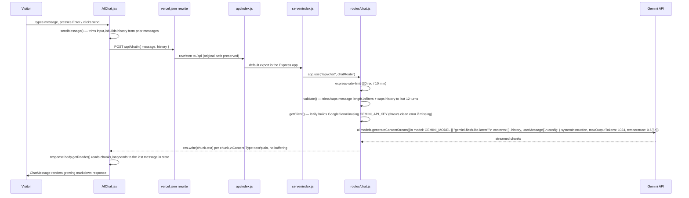
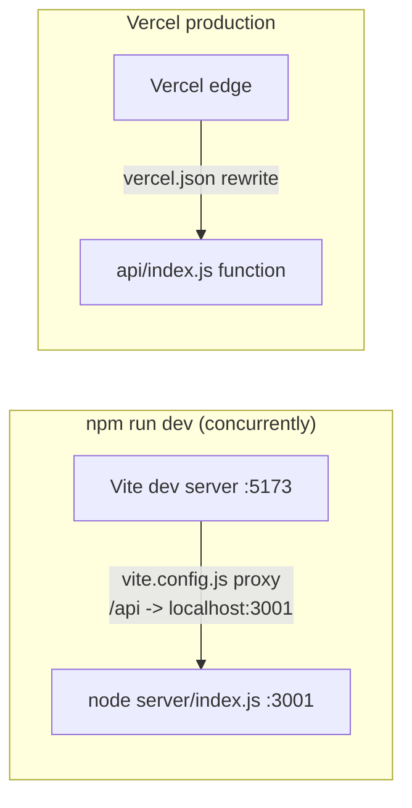

# Data Flow

The application has exactly one meaningful data flow: the AI chat round trip. Everything else (particle rendering, role-text animation) is client-only with no network call.

## AI Chat flow (confirmed: `src/components/AIChat.jsx`, `server/routes/chat.js`)

Notes confirmed from the actual code (`server/routes/chat.js`):

- `systemInstruction` comes from `server/ai/systemPrompt.js`, which inlines `PORTFOLIO_CONTEXT` from `server/ai/portfolioContext.js` — see [[AI Portfolio Context]].
- History sent to Gemini is never trusted as-is: filtered to well-formed `{role, content}` entries, capped to the last 12 messages, and each message capped to 2000 characters.
- On a pre-stream failure (bad request, missing API key, Gemini rejects the request before any chunk arrives), the route returns a clean JSON `{ success: false, message }` with an appropriate status. On a mid-stream failure, headers are already sent, so it just calls `res.end()` — the client's fetch loop treats an incomplete stream as an error via `!receivedAny`.
- `AIChat.jsx` distinguishes idle / streaming / error client-side state (`status`), and drops the empty placeholder AI message on failure rather than leaving a blank bubble.

## Local dev vs. production request path

The route through `vercel.json` + `api/index.js` only exists in production. Locally (`npm run dev`), Vite's dev server proxies `/api/*` straight to the Express process:

Both paths ultimately execute the same `server/index.js` Express app and the same `routes/chat.js` handler — see [[Backend]].

## Flows that do NOT exist in this codebase

The following were part of an earlier iteration of this project and were explicitly removed. They are listed here only so this documentation isn't silently wrong about them — there is no corresponding architecture page for either:

- **Contact form → `/api/contact` → Nodemailer → Gmail.** No `Contact.jsx`, no `/api/contact` route, no `nodemailer` dependency exist in the current source. Confirmed by `grep`ing the repo and reading `package.json`.
- Any flow involving a database, since none is used — see [[Database]].
