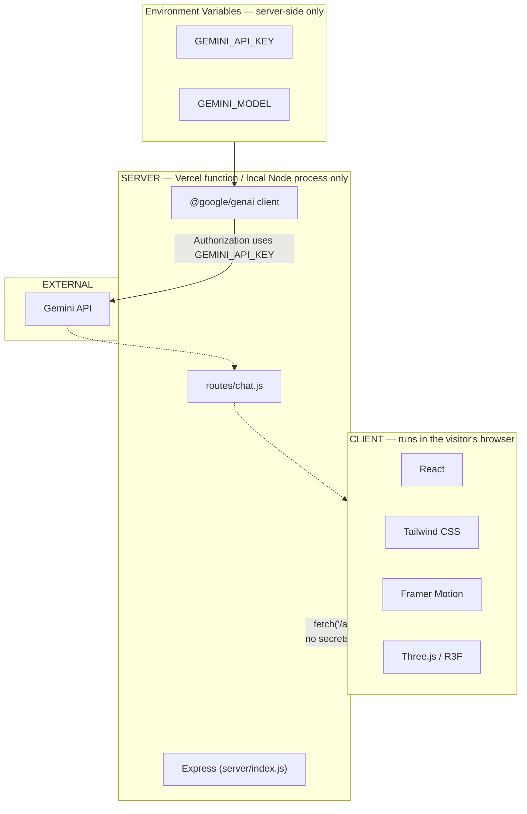

# Security

## System boundaries

- **CLIENT**: React, Tailwind CSS, Framer Motion, Three.js/`@react-three/fiber`/`@react-three/drei`. No secrets, no direct external API calls. The only network request it makes is a same-origin `POST /api/chat`.
- **SERVER**: Express, `express-rate-limit`, `@google/genai`. Holds `GEMINI_API_KEY`. Runs only inside the Vercel function or a local Node process — never shipped to the browser.
- **EXTERNAL**: [[Gemini AI]] — called from the server only.

## Where secrets live

- Local dev: `.env` (gitignored — `.gitignore` excludes `.env`, `.env.*`, with an explicit `!.env.example` exception for the placeholder file).
- Production: Vercel project environment variables (Production scope), set via `vercel env add`, never printed by any tooling command (`vercel env ls` shows names with values marked `Hidden`).
- Confirmed during this project's deployment: no secret value appears anywhere in the GitHub repository's committed history, the built `dist/` JS bundle, or any `/api/chat` HTTP response (including error responses — the API returns generic messages and logs real error detail server-side only via `console.error`).

## Which APIs require credentials

Only [[Gemini AI]] (`GEMINI_API_KEY`). No other external API call exists in this codebase.

## Validation boundaries

All validation for the one API endpoint happens server-side in `routes/chat.js` (`validate()`) — message length cap, history filtering/capping, rate limiting (30 req / 10 min via `express-rate-limit`). The client (`AIChat.jsx`) also caps `maxLength` on its `<textarea>`, but that's a UX affordance, not the actual security boundary — the server never trusts it.

## The `pointer-events` chain (a client-side, non-secret but real architectural boundary)

Not a security concern in the credentials sense, but a deliberate boundary worth documenting because it's easy to accidentally break: [[App]]'s root div, `<main>`, and [[Hero]]'s `<section>` are all `pointer-events-none`, so drag/zoom gestures on "empty" space reach the fixed 3D canvas from [[AmbientBackground]] underneath them. Every genuinely interactive element (the [[Header]] logo link, [[SocialLinks]], [[AIChat]]) explicitly opts back in with `pointer-events-auto`. [[AnimatedRole]]'s decorative text additionally sets an inline `style={{ pointerEvents: "none" }}` because Framer Motion's `motion.span` can otherwise set its own inline `pointer-events` that would override an inherited CSS class. Reproduced across multiple component pages because each is a place a future edit could silently reintroduce a click-blocking layer.
