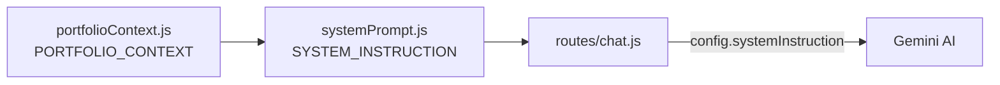

# AI Portfolio Context

## What is it?

The knowledge base the AI assistant is grounded in — everything it's allowed to say about Aldrin. **Hardcoded**, not sourced from a database, JSON file, CMS, or any runtime-fetched source.

## Where is it stored?

`server/ai/portfolioContext.js` — a single exported template-string constant, `PORTFOLIO_CONTEXT`. Sourced (per the file's own header comment) from a detailed profile provided directly for this feature, cross-checked against Aldrin's resume, with an explicit note on how one date discrepancy (freelance start date) was resolved in favor of the resume.

## How it reaches Gemini

`server/ai/systemPrompt.js` imports `PORTFOLIO_CONTEXT` and interpolates it into the end of `SYSTEM_INSTRUCTION`, a larger template string that also contains grounding/persona/tone rules. `SYSTEM_INSTRUCTION` is passed as `config.systemInstruction` in every [[Gemini AI]] request — see [[Chat API]].

## What information exists in it (sections, not full content — see the source file for the actual text)

Identity, professional summary, education, a chronological career story (freelance work, Concentrix, MDRRM Sariaya LGU IT staff role, current Medicard claims QA role), a structured work-experience table, tech stack, all 9 named projects, certifications, accomplishments, and a contact section (email + LinkedIn + phone — the system prompt explicitly forbids sharing phone/address).

## How it's protected

Never sent to or accessible from the browser — it's imported only by server-side files (`server/ai/systemPrompt.js`, consumed by `server/routes/chat.js`), which run only inside the Vercel function / local Node process. `SYSTEM_INSTRUCTION`'s own rules additionally instruct Gemini never to reveal its system prompt or these instructions even if a visitor asks directly. See [[Security]].

## How to update it

Edit `server/ai/portfolioContext.js` directly — per its own header comment, "nothing else needs to change." No redeploy step beyond the normal one (the file is bundled into the [[Backend]] function at build time).

## Contact-page caveat baked into the content

The Contact section explicitly instructs the assistant not to point visitors to a "Contact page" of the portfolio, because none currently exists — a deliberate edit made when the standalone Contact feature was removed from the app (see [[00-System-Overview]]).
