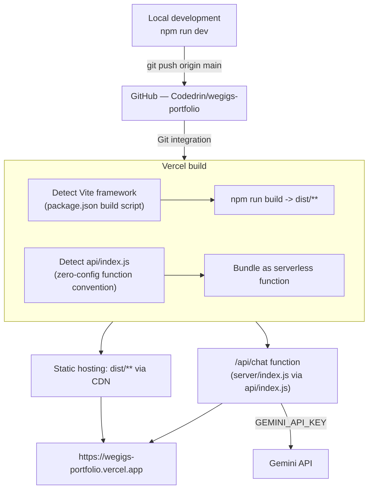

# Deployment

## Pipeline

Also deployable manually without a GitHub push: `vercel deploy --prod` from the project root, which uploads the local working tree directly.

## Why `api/index.js` + `vercel.json` exist (not just `server/index.js`)

Confirmed by direct testing during this project's deployment: Vercel's zero-config Express detection (an entry file at `app`/`index`/`server` `.js` at the project root or under `src/`) does **not** reliably trigger when a Vite framework preset is also detected for the same project — a first deployment attempt with only a root `server.js` produced zero registered functions and a `404` on `/api/chat`. The fix that was verified working in production is the standard Vite+Express hybrid pattern:

1. `api/index.js` — any file under `api/` is unconditionally detected by Vercel as a serverless function, regardless of the Vite preset.
2. `vercel.json`'s `{ "rewrites": [{ "source": "/api/:path*", "destination": "/api" }] }` — routes every `/api/chat`-style request to that one function while preserving the original path, which Express's own internal router (`app.use("/api/chat", chatRouter)`) then matches normally.

## Build steps

1. `npm install`
2. `npm run build` (`vite build`) → `dist/`
3. Vercel uploads `dist/**` to its CDN and `api/index.js` (+ its imports, i.e. all of `server/`) as the function bundle.

## Local vs. production entry point

See [[Backend]] for the `server/index.js` code that branches on `process.env.VERCEL` to skip `app.listen()` in production.

## What depends on this

Nothing in the app itself — this is purely how [[Vercel]] and [[GitHub]] get the code live. See those pages for service-level detail, and [[Environment Variables]] for what's configured in the Vercel dashboard/CLI.
