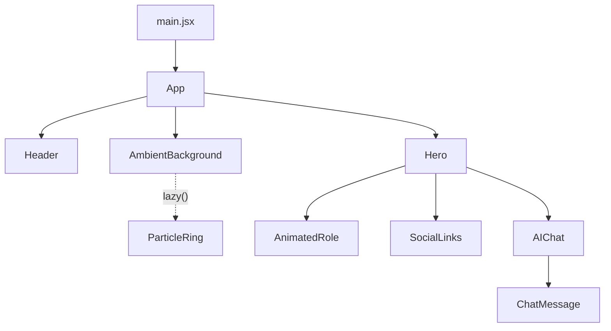

# Frontend

## What is it?

The entire client-side application — everything that runs in the visitor's browser. A React 19 single-page app built with Vite, with no router (one page, one section) and no client-side data store beyond individual components' own `useState`.

## Where is it?

`src/`, entry point `src/main.jsx`.

## What does it do?

Renders the hero page: header, animated particle background, name/role intro, social links, and the AI chat box. Talks to the backend only via `fetch("/api/chat")`.

## What does it depend on?

- [[React]] — rendering.
- [[Styling]] — Tailwind CSS v4.
- [[Animations]] — Framer Motion.
- [[Three.js]] / [[Particle System]] / [[3D Interaction]] — the background.
- [[Chat API]] — the one network call it makes.

## What depends on it?

Nothing — it's the top of the client-side tree. [[Vercel]] serves its built output (`dist/**`) as static assets.

## Component tree (confirmed from imports)

See [[Components]] for the index of individual component pages, and [[Source-Code-Map]] for exact file paths.

## Build tooling

- **Vite** (`vite.config.js`) — dev server + build. Config: `@vitejs/plugin-react`, `@tailwindcss/vite`, and a dev-only proxy forwarding `/api/*` to `http://localhost:3001` (the local Express server).
- No `tailwind.config.js` — Tailwind v4 uses CSS-first `@theme` configuration directly in `src/index.css`.
